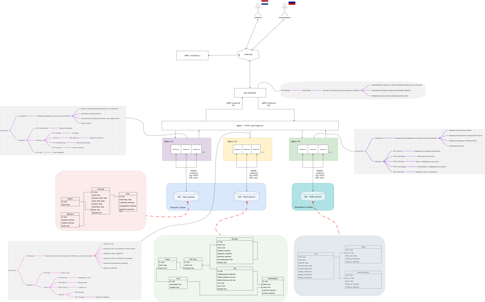

# SecureChat_UserService
Проект маленького корпоративного чата, выполненого по микросервисной архитектуре.
Общая схема всего проекта находится на диске: [ссылка](https://drive.google.com/drive/folders/1tUItggBQMCrbdZEPPIlTtHRC0EDumBGJ?usp=sharing)

